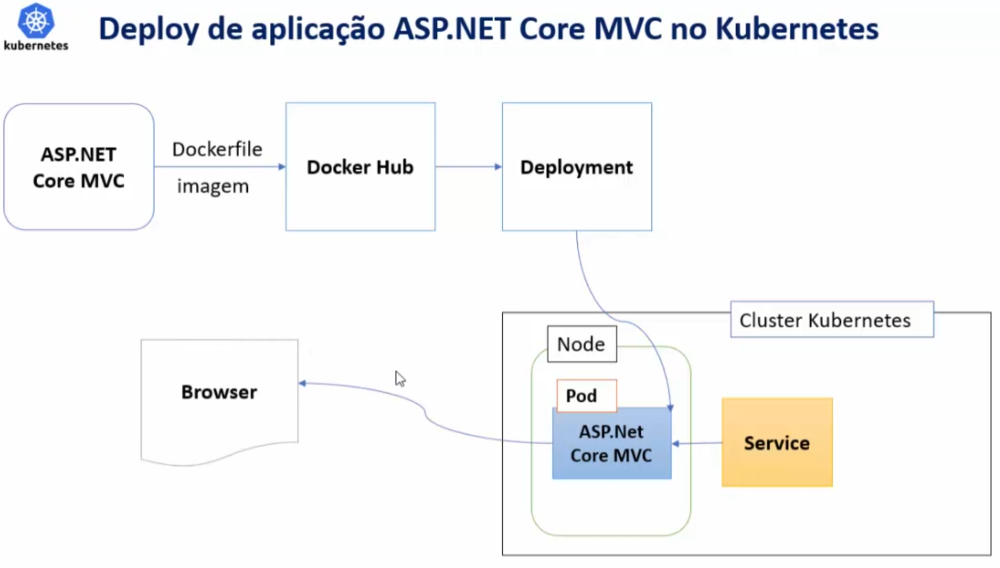

# Fluxo completo de publicação de uma aplicação AspNetCore no Kubernetes

- Criada a aplicação

- Adicionado suporte à Docker (criando o Dockerfile)

## Cria a Imagem da Aplicação
Use o commando `docker build -f frontend/Dockerfile -t pizzafrontend .` na pasta da solution (note o . no final do comando)

Teste a imagem com o comando `docker container run -d -p 8090:80 --name testemvc pizzafrontend`

Abra localhost:8090 no browser e veja se a aplicação está funcionando

## Subir a imagem para o Docker Hub
Execute o comando `docker login` se você já estiver logado no Docker ele usará estas credenciais

Execute o comando `docker tag pizzafrontend <seu-usuario>/pizzafrontend` para criar uma tag para sua imagem

Execute o comando `docker push <seu-usuario>/pizzafrontend` para subir a imagem para o Docker Hub

## Criar o Deployment (kubernetes)
Conforme o arquivo frontend/frontend-deploy.yml

## Implantar o Deployment no Cluster Kubernetes
Use o comando `kubectl apply -f frontend/frontend-deploy.yml`

Neste momento teremos a aplicação rodando dentro de um Pod e dentro de um Node de um Cluster Kubernetes
	
## Criar um Service (kubernetes)
Conforme o arquivo frontend/frontend-service.yml

Use o comando `kubectl apply -f frontend/frontend-service.yml` para implantar o service no kubernetes
	
## Expor esta aplicação para o mundo externo para poder acessá-la pelo browser
Use o comando `minikube service pizzafrontend`

O kubernetes vai criar um tunnel para a aplicação e abrirá o browser com a aplicação rodando

Obs: Para fins de teste e debug temporário  é possível também fazer um port-forward usando o comando `kubectl port-forward service/pizzafrontend 7080:8080` e acessar a aplicação pelo browser em localhost:7080	
		
