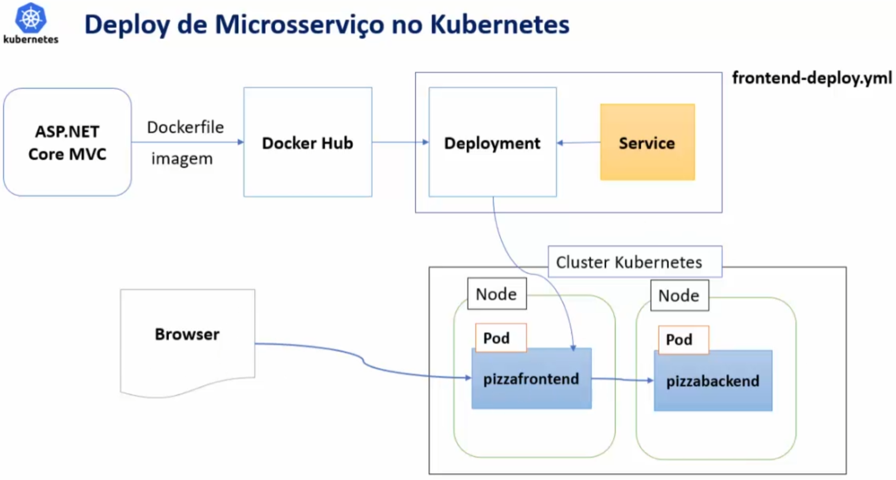

# Deploy de uma solução de Microsserviços no Kubernetes

A Solução terá a seguinte Arquitetura:

Nesta aplicação dois serviços serão criados, um frontend e um backend. Somente o frontend será exposto para o mundo externo. O frontend acessará o backend internamente dentro do cluster kubernetes
## Criando as Imagens do Backend e do Frontend da Solução

Use o comando `docker build -f backend\Dockerfile -t backend .` Note o ponto ( . ) no final do comando

Use o comando `docker build -f frontend\Dockerfile -t frontend .` Note o ponto ( . ) no final do comando

## Envie a imagem para o DockerHub

Use `docker login` para se logar na sua conta do DockerHub

Use `docker tag backend <seu_usuario>/pizzabackend` para criar uma tag para o backend

Use `docker tag frontend <seu_usuario>/pizzafrontend` para criar uma tag para o frontend

Use `docker push <seu_usuario>/pizzabackend` para enviar a imagem do backend para o DockerHub

Use `docker push <seu_usuario>/pizzafrontend` para enviar a imagem do frontend para o DockerHub

## Deploy dos Serviços no Kubernetes
O arquivo `backend-deploy.yml` e o arquivo `frontend-deploy.yml` contém a definição de um `Deployment` e de um `Service` do Kubernetes, tudo no mesmo arquivo.

O arquivo `backend-deploy.yml` o Service do backend está definido com o tipo `ClusterIP`, ou seja, ele só pode ser acessado dentro do cluster, isso porque o backend não precisa expor nada para o mundo exterior e o frontend está rodando dentro do mesmo cluster.

Já o arquivo `frontend-deploy.yml` tem seu Service definido como `LoadBalancer` para expôr a porta para que ela fique acessível pelo browser

Use `kubectl apply -f <NomeDoArquivo.yml>` para fazer o deploy no Kubernetes.

## Testando o Deploy

Use `minikube service pizzafrontend` Isso vai criar o tunnel para o serviço e abrir o browser com a aplicação rodando.

