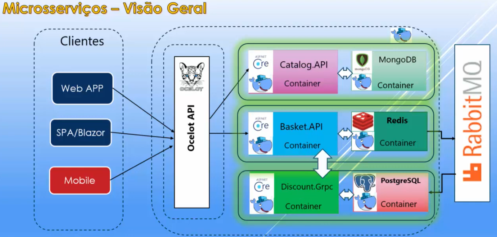

# Projeto de Microserviços do curso de Docker do Macoratti na UDEMY

Link para o [Curso na UDEMY](https://www.udemy.com/course/docker-essencial-para-a-plataforma-net).

A arquitetura desenvolvida no curso foi a seguinte:

A parte de CLientes, OCELOT.NET e RabbitMQ não foi mostrada no curso pois estava fora do escopo

